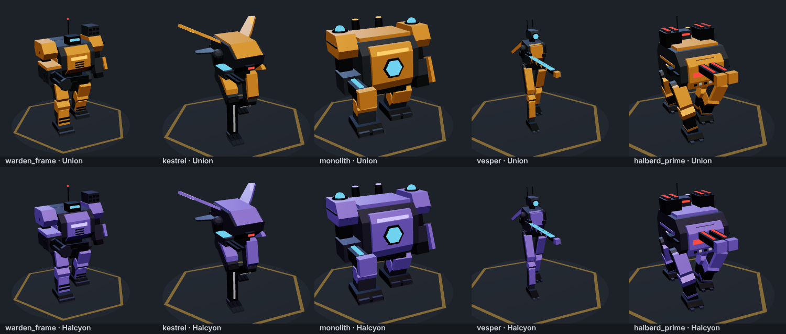
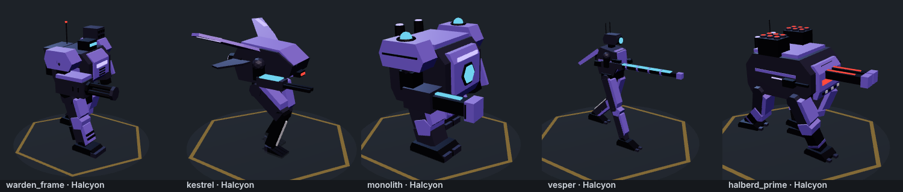

# BRANCHLIKE frames — design sheet

All five frames are original BRANCHLIKE designs, built in code (`src/render/mechs3d.ts`) from primitives and extruded silhouettes. No third-party models, textures or reference art are used. Card portraits are rendered from the same models (`tools/render-cards.mjs`), so cards and battlefield always match.

## Design language

- **Silhouette first.** Each frame has to read from above at phone size: a box-torso brawler, a winged bird-legged skirmisher, a walking bunker, a stilt-legged sniper, a four-legged siege engine.
- **Two factions, one palette rule.** Corsair Union: amber armour over gunmetal, warm glow. Halcyon Directorate: violet armour over slate, cool glow. Danger red is kept for weapons-hot lights and the boss.
- **Armour over frame.** Team-colour plates (thighs, greaves, pauldrons, chest) sit on a darker structural frame with visible joints and pistons.
- **Glow means function.** Visors, reactor vents, rail strips and emitters glow; nothing glows for decoration.

## The frames

| Frame | Role | Silhouette | Signature parts | Gait |
| --- | --- | --- | --- | --- |
| **Warden** | Line frame | Upright, chunky, square shoulders | Rotary cannon arm, left-shoulder rocket pod, forearm shield, back reactor with three vents | Standard human gait |
| **KESTREL-9** | Hero skirmisher | Hunched, forward-leaning, swept wings | Reverse-jointed bird legs with three-toed feet, glowing canopy, two jump thrusters, twin autocannons | Digitigrade: knees bend backwards |
| **MONOLITH** | Hero juggernaut | Wide and low, a walking bunker | Hex Aegis projector in the chest, pauldrons topped with field emitters, siege cannon, shield fist | Short heavy steps, dust and screen shake on every footfall |
| **VESPER** | Hero marksman | Tall, narrow, stilt legs | Single-lens sensor head, stabiliser fins, rail rifle longer than the frame is tall, with coil rings | Long strides |
| **HALBERD PRIME** | Boss (Halcyon) | Four-legged armoured hull | Twin-barrel spinal cannon, missile silos, command tower, sponson guns, splayed legs | Trot (diagonal leg pairs), heavy footfalls |

## Rig and animation

Each frame is a small rig: hip → knee → foot per leg, a torso, an arm and a gun arm (`AnimPart.parent` in `src/render/models3d.ts`). The renderer drives a procedural walk cycle (`View3D.animateRig`):

- Hips swing ±0.42 rad; knees fold during the forward swing (reversed for KESTREL-9); feet counter-rotate to stay level.
- Stride length is per frame, so big frames take slower, longer steps and feet don't skate.
- The body dips as the legs spread; the torso rolls and twists with each step and breathes when idle.
- The free arm swings opposite its leg; the gun arm recoils when firing.
- Footfalls kick up dust; MONOLITH and HALBERD PRIME also shake the camera slightly.
- Frame-fall from orbit, landing shockwave and damage smoke are unchanged.

## Performance

A frame is 9–14 parts (one or two draw calls each, vertex-coloured, no textures). Ten frames on the field measured 150 draw calls with shadows on, inside the 250 budget checked by the smoke test. Low graphics turns shadows off.

## Tools

- `node tools/mechsheet.mjs out.png [--teams=0,1] [--angles=-0.55,2.4] [--t=0.35] [--units=a,b]` renders a design sheet.
- `node tools/render-cards.mjs` re-renders the card portraits into `public/img/units/` after a model change (run `npm run build` first).
- The hangar unit page shows a rotating, walking 3D model (static if reduce motion is on).
